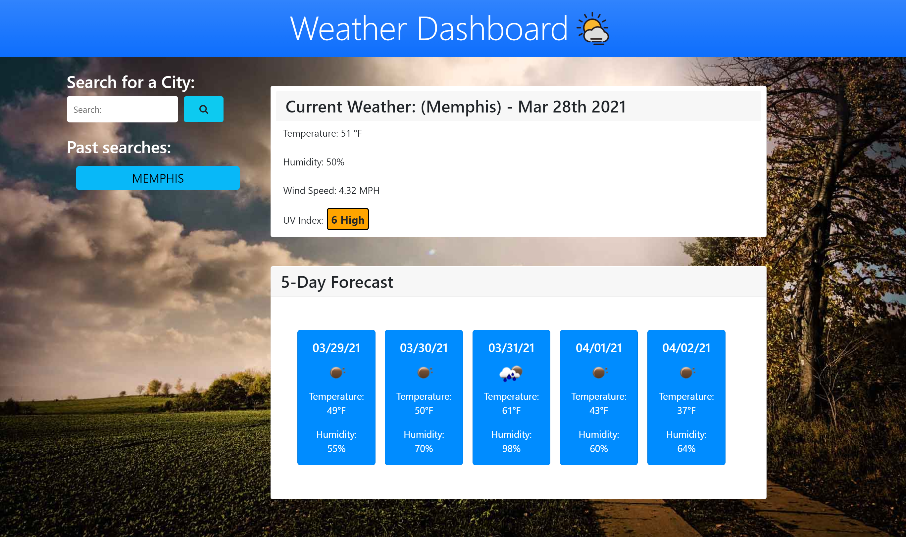

# Server-Side APIs Challenge: Weather Dashboard

## PROJECT DESCRIPTION:

---

- Create an application that user can check their local weather
- Use the OpenWeather API to retrieve weather data for cities
- Include dynamically updated HTML and CSS powered by JavaScript.
- Code JavaScript to fetch requests to the OpenWeather API to produce
  - Current weather for selected location
  - The five day forecast for that location

---

### CODING LANGUAGES USED:

---

- HTML
- CSS
- JAVASCRIPT

#### SCREENSHOTS:

---

## 

## 

##### LINKS:

---

## [GitHub Weather Dashboard Repo](https://github.com/MichealJWEllis/Weather_DashBoard)

## [Weather Dashboard Website](https://michealjwellis.github.io/Weather_DashBoard/)

---

#### CONTRIBUTION:

Made with ❤️ by [Micheal Jw Ellis]
